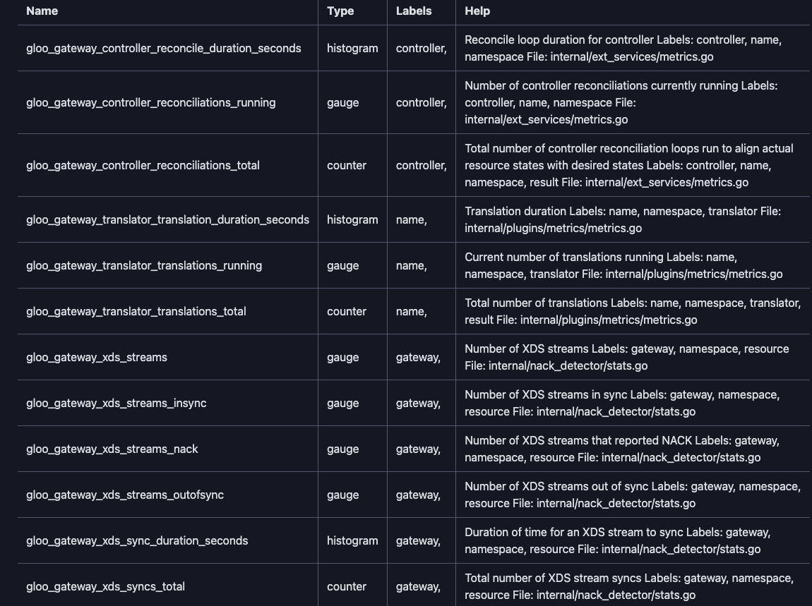
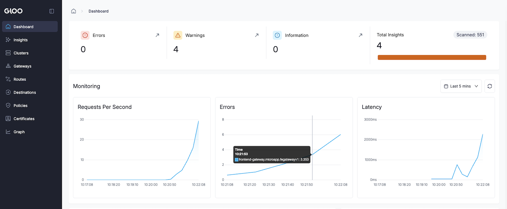
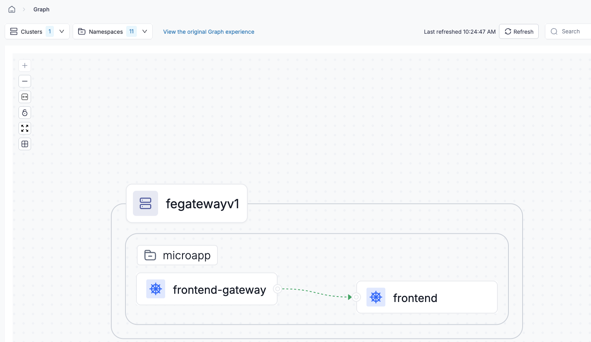
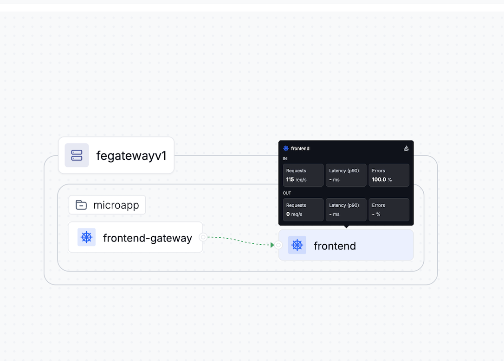
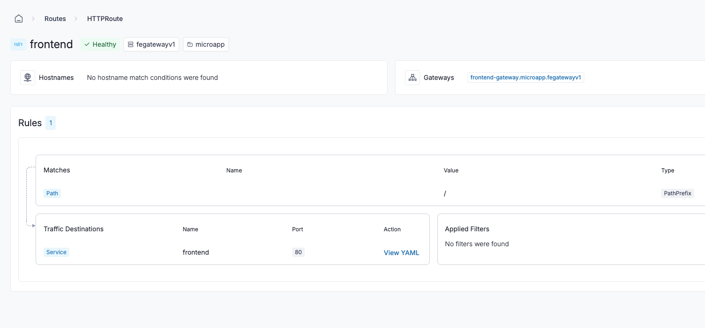

# Gloo Gateway V1/V2 Demo
<p align="center">
 
</p>


The purpose of this demo is to showcase how to not only install and configure Gloo Gateway (v1 for portal and v2 for everything else), but to have comprehensive tests for:

- Resilience
- Reliability
- Failover
- Uptime

And overall traffic management needs

# Gloo Gateway V2 Configs

The following sections will showcase everything from a Gloo Gateway V2 perspective including installation, configuration, and resilience configs.

## Installation Gloo Gateway v2

### Cluster

For the purposes of this demo, you can use any managed Kubernetes cluster you'd like, but if you need a ready-to-go config, you can deploy GKE via the Terraform configs in this repo.

If you use the Terraform configs, remember to be authenticated on your local terminal to GCP.


1. `cd` into the **ggv2/gke1** directory.

2. Update the variables in `variables.tf` to reflect your variables (or create a `terraform.tfvars` file)

3. Initialize the TF config
```
terraform init
```

4. Run the plan
```
terraform plan
```

5. Apply the TF configs to create the GKE cluster with auto-approve
```
terraform apply --auto-approve
```

<p align="center">
 
</p>


### Helm
1. Configure product key env variables

```
export GLOO_GATEWAY_LICENSE_KEY=
export AGENTGATEWAY_LICENSE_KEY=
```

2. Install Kubernetes Gateway API
You need the experimental version as Gloo Gateway v2 has a requirement of the `BackendConfigPolicy` object, which is an experimental feature in Kubernetes Gateway API.

```
kubectl apply -f https://github.com/kubernetes-sigs/gateway-api/releases/download/v1.3.0/experimental-install.yaml
```

3. Install Gloo Gateway v2 CRDs
```
helm upgrade -i gloo-gateway-crds oci://us-docker.pkg.dev/solo-public/gloo-gateway/charts/gloo-gateway-crds \
--namespace gloo-system \
--version 2.0.0-rc.2 \
--create-namespace
```

4. Install Gloo Gateway v2
```
helm upgrade -i gloo-gateway oci://us-docker.pkg.dev/solo-public/gloo-gateway/charts/gloo-gateway \
-n gloo-system \
--version 2.0.0-rc.2 \
--set licensing.glooGatewayLicenseKey=$GLOO_GATEWAY_LICENSE_KEY
```


#### Argo/GitOps

ArgoCD installation is available as well: https://docs.solo.io/gateway/2.0.x/install/argocd/

## Sample App Deployment

1. Create the Namespace for the microapp (extensive decoupled app)
```
kubectl create ns microapp
```

2. Deploy the sample decoupled application stack
```
kubectl apply -f ggv2/sampleapp-microdemo/microservices-demo/release/kubernetes-manifests.yaml -n microapp
```

3. Confirm that the app stack is running
```
kubectl get pods -n microapp
```

You can also see the Services that are deployed, which is what you'll use to create the backend routes in the next step.

```
kubectl get svc -n microapp
```

4. Create a Gateway for the application

The `allowedroutes` portion means that you can create an `HTTPRoute` resource from all Namespaces

```
kubectl apply --context=$CLUSTER1 -f - <<EOF
apiVersion: gateway.networking.k8s.io/v1
kind: Gateway
metadata:
  name: frontend-gateway
  namespace: microapp
spec:
  gatewayClassName: gloo-gateway-v2
  listeners:
  - name: frontend
    port: 80
    protocol: HTTP
    allowedRoutes:
      namespaces:
        from: All
---
apiVersion: gateway.networking.k8s.io/v1
kind: HTTPRoute
metadata:
  name: frontend
  namespace: microapp
spec:
  parentRefs:
  - name: frontend-gateway
  rules:
  - matches:
    - path:
        type: PathPrefix
        value: /
    backendRefs:
      - name: frontend
        port: 80
EOF
```

5. Check to see the gateway IP address.

```
kubectl get gateway -n microapp
```

Example output below:
```
NAME               CLASS             ADDRESS         PROGRAMMED   AGE
frontend-gateway   gloo-gateway-v2   x.x.x.x   True         36m
```


You can now `curl` the gateway IP or use a tool like Postman.

## Gateway UI
1. Capture your cluster name as an environment variable for the UI installation in the coming steps.
```
export CLUSTER_NAME=fegatewayv1

echo $CLUSTER_NAME
```

2. Add the Gloo Platform Chart (for the UI)
```
helm repo add gloo-platform https://storage.googleapis.com/gloo-platform/helm-charts
helm repo update
```

3. Install the Gloo Platform CRDs
```
helm upgrade -i gloo-platform-crds gloo-platform/gloo-platform-crds \
--namespace=gloo-system \
--version=2.10.1 \
--set installEnterpriseCrds=false
```

4. Deploy the UI Helm Chart

You'll see that the enterprise version of the chart gives you:
- The UI
- Gloo Insights that you can see from the portal
- Prometheus enabled for metrics collection
- A Telemetry collector

```
helm upgrade -i gloo-platform gloo-platform/gloo-platform \
--namespace gloo-system \
--version=2.10.1 \
-f - <<EOF
common:
  adminNamespace: "gloo-system"
  cluster: $CLUSTER_NAME
glooInsightsEngine:
  enabled: true
glooAnalyzer:
  enabled: true
glooUi:
  enabled: true
licensing:
  glooGatewayLicenseKey: $GLOO_GATEWAY_LICENSE_KEY
prometheus:
  enabled: true
telemetryCollector:
  enabled: true
  mode: deployment
  replicaCount: 1
EOF
```

5. Ensure that the UI it's running as expected (you should see 3 containers in the Pod)
```
kubectl get pods -n gloo-system
```

6. Access the UI
```
kubectl port-forward deployment/gloo-mesh-ui -n gloo-system 8090
```


## Monitoring, Observability, & Telemetry

1. Add the Grafana Helm Chart
```
helm repo add grafana https://grafana.github.io/helm-charts
```

2. Install Grafana in the `monitoring` Namespace
```
helm install grafana grafana/grafana --namespace monitoring --create-namespace
```

3. Retrieve the default admin password from the Kubernetes Secret.

The default username is: `admin`

```
kubectl get secret --namespace monitoring grafana -o jsonpath="{.data.admin-password}" | base64 --decode ; echo
```

4. Access the Grafana UI
```
kubectl port-forward svc/grafana 3000:80 --namespace monitoring
```

5. Add a new metrics endpoint by going to: **Connections > Data Sources > Choose Prometheus

Under the Connection URL, add the following:
```
http://prometheus-server.gloo-system.svc.cluster.local:80
```

You'll now be able to see Metrics and create Dashboard in Grafana


For a list of metrics exposed via the Control Plane:




## Traffic Debugging

Debugging live traffic, ensuring health of traffic, and showcasing policies can be done from your monitoring & observability tool of choice, but also form the Gloo UI.

1. Port-forward to the deployed UI
```
kubectl port-forward deployment/gloo-mesh-ui -n gloo-system 8090
```

2. Access the UI in a browser

```
127.0.0.1:8090
```

From the dashboard, you can see requests per second, errors, and any latency that may be occurring, or has occurred, within your application.



The Graph can give you information on how your Services are connected and various forms of telemetry data like requests, latency, and errors. 




Without Routes, you can see the HTTP Routes for your application including any hostnames, the Gateways the route is attached to, and the path/destination.



## Rate Limiting

With Gloo Gateway v2, you will see that there is a Rate Limit server out of the box.

```
kubectl get svc -n gloo-system
NAME                               TYPE        CLUSTER-IP       EXTERNAL-IP   PORT(S)                      AGE
rate-limiter-gloo-gateway-v2       ClusterIP   34.118.226.186   <none>        8083/TCP,8084/TCP,9091/TCP   6m1s
```

You can set the traffic policy for the `HTTPRoute` that you configured a few sections ago.

1. Apply the `TrafficPolicy` for local rate limiting
```
kubectl apply -f- <<EOF
apiVersion: gloo.solo.io/v1alpha1
kind: GlooTrafficPolicy
metadata:
  name: local-frontend
  namespace: microapp
spec:
  targetRefs:
    - group: gateway.networking.k8s.io
      kind: HTTPRoute
      name: frontend
  rateLimit:
    local:
      tokenBucket:
        maxTokens: 1
        tokensPerFill: 1
        fillInterval: 100s
EOF
```

2. Confirm that the traffic policy has been created
```
kubectl get glootrafficpolicy -n microapp

NAME             AGE
local-frontend   71s
```

3. Curl the demo app.
```
curl -n http://34.23.86.111
```


4. Send the `curl` again and you'll see an output like the below:

```
local_rate_limited% 
```

The reason why is because the `GlooTrafficPolicy` configured only has one (1) token and it is refilled every 100 seconds.

5. Delete the `GlooTrafficPolicy` to avoid any rate limiting issues for the testing through the POC.

## Advanced Routing

WIP

- Load balanced routing
- Canary
- Authenication
- Redirection

https://docs.solo.io/gateway/2.0.x/traffic-management/

## Resiliency/Circuit Breaking

In this section, you will find three subsections that showcase resilience configurations and circuit breaking (outlier detection and connection settings)

### Outlier Detection

Outlier Detection in Circuit Breaking is all about removing an unhealthy host (Pod) from the load balancing pool.

The test configuration below specifies that if the frontend host returns one 5XX HTTP response code, it'll eject the unhealthy host (Pod) for one hour.

The unhealthy host (Pod) will then be brought back into the load balancing pool after the one hour is up

```
kubectl apply -f- <<EOF
apiVersion: gateway.kgateway.dev/v1alpha1
kind: BackendConfigPolicy
metadata:
  name: microapp-dead-app-protection
  namespace: microapp
spec:
  targetRefs:
    - name: frontend
      group: ""
      kind: Service
  outlierDetection:
    interval: 2s
    consecutive5xx: 1
    baseEjectionTime: 1h
    maxEjectionPercent: 80
EOF
```

### HTTP Connecting Settings

1. Timeout and read/write buffer limits for connections to the Service.
```
kubectl apply -f - <<EOF
apiVersion: gateway.kgateway.dev/v1alpha1
kind: BackendConfigPolicy
metadata:
  name: microapp-buffer
  namespace: microapp
spec:
  targetRefs:
    - name: httpbin
      group: ""
      kind: Service
  connectTimeout: 5s
  perConnectionBufferLimitBytes: 1024
EOF
```

2. Additional connection options when handling upstream HTTP requests
```
kubectl apply -f - <<EOF
apiVersion: gateway.kgateway.dev/v1alpha1
kind: BackendConfigPolicy
metadata:
  name: microapp-connections
  namespace: microapp
spec:
  targetRefs:
    - name: frontend
      group: ""
      kind: Service
  commonHttpProtocolOptions:
    idleTimeout: 10s
    maxHeadersCount: 15
    maxStreamDuration: 30s
    maxRequestsPerConnection: 100
EOF
```

### Retries

Retries enhances an app’s availability by making sure that calls don’t fail permanently because of transient problems, such as a temporarily overloaded service or network.

1. Delete the `HTTPRoute` that you created during the sample app deployment
```
kubectl delete httproute frontend -n microapp
```

2. Capture the Gateway address
```
export INGRESS_GW_ADDRESS=$(kubectl get svc -n microapp frontend-gateway -o jsonpath="{.status.loadBalancer.ingress[0]['hostname','ip']}")
echo $INGRESS_GW_ADDRESS
```

2. Set up an access policy that tracks the number of retries.
```
kubectl apply -f- <<EOF
apiVersion: gateway.kgateway.dev/v1alpha1
kind: HTTPListenerPolicy
metadata:
  name: access-logs
  namespace: microapp
spec:
  targetRefs:
  - group: gateway.networking.k8s.io
    kind: Gateway
    name: frontend-gateway
  accessLog:
  - fileSink:
      path: /dev/stdout
      jsonFormat:
        start_time: "%START_TIME%"
        method: "%REQ(:METHOD)%"
        path: "%REQ(:PATH)%"
        response_code: "%RESPONSE_CODE%"
        response_flags: "%RESPONSE_FLAGS%"
        upstream_host: "%UPSTREAM_HOST%"
        upstream_cluster: "%UPSTREAM_CLUSTER%"
EOF
```

2. Create a new `HTTPRoute` to test against. This `HTTPRoute` can be used within the `GlooTrafficPolicy` that applies a retry policy.
```
kubectl apply -f- <<EOF
apiVersion: gateway.networking.k8s.io/v1
kind: HTTPRoute
metadata:
  name: retry
  namespace: microapp
spec:
  hostnames:
  - retry.example
  parentRefs:
  - group: gateway.networking.k8s.io
    kind: Gateway
    name: frontend-gateway
    namespace: microapp
  rules:
  - matches:
    - path:
        type: PathPrefix
        value: /
    backendRefs:
    - group: ""
      kind: Service
      name: frontend
      port: 80
    name: timeout
EOF
```

3. Create the traffic policy for retries
```
kubectl apply -f- <<EOF
apiVersion: gloo.solo.io/v1alpha1
kind: GlooTrafficPolicy
metadata:
  name: retry
  namespace: microapp
spec:
  targetRefs:
  - kind: HTTPRoute
    group: gateway.networking.k8s.io
    name: retry
    sectionName: timeout
  retry:
    attempts: 3
    backoffBaseInterval: 1s
    retryOn:
    - 5xx
    - unavailable
  timeouts:
    request: 20s
EOF
```

4. Get the gateway address and send a request
```
curl -vi http://$INGRESS_GW_ADDRESS/cart -H "host: retry.example:8080"
```

5. Check that no retry occurred
```
kubectl logs -n microapp -l gateway.networking.k8s.io/gateway-name=frontend-gateway | tail -1 | jq
```

6. Scale the app down to `0`
```
kubectl scale deployment cartservice -n microapp --replicas=0
```

7. Curl again
```
curl -vi http://$INGRESS_GW_ADDRESS/cart -H "host: retry.example:8080"
```

8. Open a new tab while the `curl` is running and look at the logs
```
kubectl logs -n microapp -l gateway.networking.k8s.io/gateway-name=frontend-gateway | tail -1 | jq
```

You should see

```
{
  "method": "GET",
  "path": "/cart",
  "response_code": 500,
  "response_flags": "URX",
  "start_time": "2025-10-09T17:38:28.530Z",
  "upstream_cluster": "kube_microapp_frontend_80",
  "upstream_host": "10.68.3.29:8080"
}
```

URX = UpstreamRetryLimitExceeded (retries happened!)

9. Scale back up
```
kubectl scale deployment cartservice -n microapp --replicas=1
```


## Cleanup
To prepare your environment for the next part of the demo, which will be on Gloo Gateway v1 with Portal, destroy your cluster.

If you use the GKE config within this repo:

1. `cd` into the **ggv2/gke1** directory.

2. Destroy the cluster
```
terraform destroy --auto-approve
```

# Gloo Gateway V1 (Portal)
In this section, you will find the full configuration for setting up Gloo Gateway v1. The reason why v1 will be used is because Portal will not be GA until Gloo Gateway v2.2.

## Installation Gateway v1

### Cluster

For the purposes of this demo, you can use any managed Kubernetes cluster you'd like, but if you need a ready-to-go config, you can deploy GKE via the Terraform configs in this repo.

If you use the Terraform configs, remember to be authenticated on your local terminal to GCP.


1. `cd` into the **ggv2/gke1** directory.

2. Update the variables in `variables.tf` to reflect your variables (or create a `terraform.tfvars` file)

3. Initialize the TF config
```
terraform init
```

4. Run the plan
```
terraform plan
```

5. Apply the TF configs to create the GKE cluster with auto-approve
```
terraform apply --auto-approve
```

<p align="center">
 
</p>

### Helm

1. Set your Gloo License Key variable
```
export GLOO_GATEWAY_LICENSE_KEY=
```

2. Install Kubernetes Gateway API
```
kubectl apply -f https://github.com/kubernetes-sigs/gateway-api/releases/download/v1.3.0/standard-install.yaml
```

3. Add the Gloo Gateway v1 Enterprise Helm repo
```
helm repo add glooe https://storage.googleapis.com/gloo-ee-helm
helm repo update
```

4. Install GGv1 Enterprise

The installation also includes:
- Grafana
- Prometheus

```
helm upgrade --install -n gloo-system gloo glooe/gloo-ee \
--create-namespace \
--version 1.20.1 \
--set-string license_key=$GLOO_GATEWAY_LICENSE_KEY \
-f - <<EOF
gloo:
  gatewayProxies:
    gatewayProxy:
      disabled: true
  kubeGateway:
    enabled: true
    portal:
      enabled: true
  gloo:
    disableLeaderElection: true
gloo-fed:
  enabled: false
  glooFedApiserver:
    enable: false
grafana:
  defaultInstallationEnabled: false
observability:
  enabled: false
prometheus:
  enabled: false
EOF
```

5. Ensure that Gloo Gateway v1 is running as expected
```
kubectl get pods -n gloo-system
```

6. Retrieve the Gateway Class 
```
kubectl get gatewayclass gloo-gateway
```

## Portal

In this previous section, you installed Gloo Gateway v1. If you take a look at the Helm config, the `portal: true` was already added in, so you won't need to do any extra configuration for the installation of Portal.

### Installation Of Portal

1. Ensure Portal is up and operational
```
kubectl get pods -n gloo-system -l app=gateway-portal-web-server
```

You should see an output similar to the below:
```
NAME                                        READY   STATUS    RESTARTS   AGE
gateway-portal-web-server-c9c78db5b-dfpfm   1/1     Running   0          2m1s
```

If you have `glooctl` installed, you can also check to confirm that all implementations (xDS, Gateways, Proxies, Rate Limiting Server, etc.) is ready to go.

```
glooctl check

glooctl binary version (1.19.6) differs from server components (v1.20.1) by at least a minor version.
Consider running:
glooctl upgrade --release=v1.20.1
----------

Checking Deployments... OK
Checking Pods... OK
Checking Upstreams... OK
Checking UpstreamGroups... OK
Checking AuthConfigs... OK
Checking RateLimitConfigs... OK
Checking VirtualHostOptions... OK
Checking RouteOptions... OK
Checking Secrets... OK
Checking VirtualServices... OK
Checking Gateways... OK
Checking Proxies... OK
No active gateway-proxy pods exist in cluster
Checking xds metrics... OK
Checking rate limit server... OK

Detected Kubernetes Gateway integration!
Checking Kubernetes GatewayClasses... OK
Checking Kubernetes Gateways... OK
Checking Kubernetes HTTPRoutes... OK

Skipping Gloo Instance check -- Gloo Federation not detected.
No problems detected.
```

### Deploy Sample Apps

For this section, please use the docs below and deploy the **Tracks** sample app

https://docs.solo.io/gateway/latest/portal/tutorials/setup/#apps

### Create API Products

For this section, please use the **Tracks** section as that's the demo app you deployed in the previous section

https://docs.solo.io/gateway/latest/portal/tutorials/portal/

### Create A Portal

https://docs.solo.io/gateway/latest/portal/tutorials/apis/

## Agentgateway (GGv2)

agentgateway is a way to secure, observe, and control the traffic to and from LLMs and MCP servers.

This wouldn't be part of a standard Gloo Gateway POC, but if interesting in seeing it, it's a "nice to see".

### Helm
1. Configure product key env variables

```
export GLOO_GATEWAY_LICENSE_KEY=
export AGENTGATEWAY_LICENSE_KEY=
```

2. Install Kubernetes Gateway API
You need the experimental version as Gloo Gateway v2 has a requirement of the `BackendConfigPolicy` object, which is an experimental feature in Kubernetes Gateway API.

```
kubectl apply -f https://github.com/kubernetes-sigs/gateway-api/releases/download/v1.3.0/experimental-install.yaml
```

3. Install Gloo Gateway v2 CRDs
```
helm upgrade -i gloo-gateway-crds oci://us-docker.pkg.dev/solo-public/gloo-gateway/charts/gloo-gateway-crds \
--namespace gloo-system \
--version 2.0.0-rc.2 \
--create-namespace
```

4. Install Gloo Gateway v2
```
helm upgrade -i gloo-gateway oci://us-docker.pkg.dev/solo-public/gloo-gateway/charts/gloo-gateway \
-n gloo-system \
--version 2.0.0-rc.2 \
--set gateway.aiExtension.enabled=true \
--set agentgateway.enabled=true \
--set licensing.glooGatewayLicenseKey=$GLOO_GATEWAY_LICENSE_KEY \
--set licensing.agentgatewayLicenseKey=$AGENTGATEWAY_LICENSE_KEY
```


## Helpful Docs

Based on the Evaluation Criteria doc, the following links will be of help for knowing that Gloo Gateway supports what you need.

1. JWT/Payload support: https://docs.solo.io/gateway/2.0.x/security/jwt/overview/
2. Load balancing support: https://docs.solo.io/gateway/2.0.x/traffic-management/session-affinity/loadbalancing/
3. Kubernetes CRD (API/object/kind) support: https://docs.solo.io/gateway/2.0.x/reference/api/gloo-gateway/
4. Gloo Mesh/Gloo Gateway working together in multi-cluster support: https://github.com/AdminTurnedDevOps/ambient-mesh-lite-demo/blob/main/multi-cluster/sampleapp-microdemo/setup.md
5. Canary deployments with Mirroring: https://docs.solo.io/gateway/2.0.x/resiliency/mirroring/