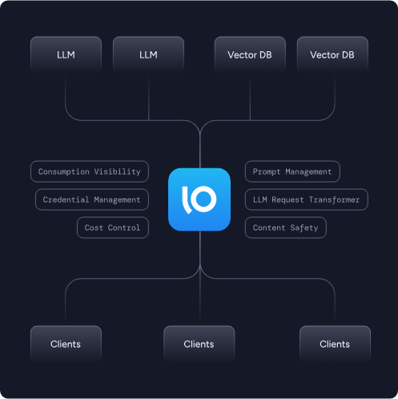
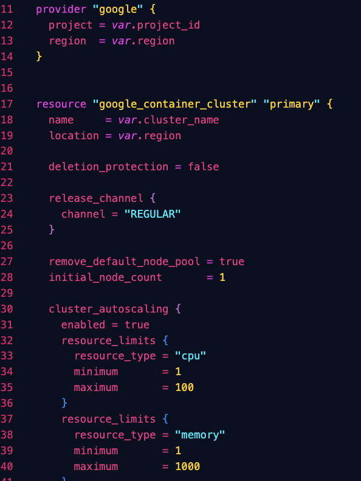

# Gloo Gateway (Gloo Edge) Demo



The purpose of this demo is to showcase how to not only install and configure Gloo Gateway with Gloo Edge APIs, but to have comprehensive tests for:

- Resilience
- Reliability
- Failover
- Uptime

And overall traffic management needs

## Installation

### CLI
```
curl -sL https://run.solo.io/gloo/install | sh
export PATH=$HOME/.gloo/bin:$PATH
```

```
export EDGE_LICENSE_KEY=
glooctl install gateway enterprise --license-key $EDGE_LICENSE_KEY
```

### Helm
```
helm repo add glooe https://storage.googleapis.com/gloo-ee-helm

helm repo update
```

```
export EDGE_LICENSE_KEY=

helm install gloo glooe/gloo-ee --namespace gloo-system \
  --create-namespace \
  --set-string license_key=$EDGE_LICENSE_KEY
```

With the free installation, you will see two primary services (and Pods):

1. gloo: Type ClusterIP exposing the ports 9966 (grpc-proxydebug), 9977 (grpc-xds), 9979 (wasm-cache), and 9988 (grpc-validation)
2. gateway-proxy: Type LoadBalancer exposing the ports 80, 443

```
kubectl get all -n gloo-system
NAME                                READY   STATUS    RESTARTS   AGE
pod/gateway-proxy-7886f4f95-mhk2q   1/1     Running   0          11m
pod/gloo-65c66f7dfd-rg74j           1/1     Running   0          11m
```

However, with Enterprise you will get the following out of the box:
- External Auth
- Prometheus
- Grafana
- Envoy-integrated rate limiting
- Caching

#### Argo/GitOps

ArgoCD installation is available as well: https://docs.solo.io/gloo-edge/latest/installation/enterprise/#argo-cd-installation

## API/CRDs

With the Gloo Edge/Gateway is installation, you will have access to enterprise-grade APIs (Customer Resource Definitions) that you can use to extend the capabilities of Kubernetes (much like any other CRD).

These extensive and mature APIs will give you the ability to manage/route traffic, set policies, and configure authentication.



## Sample App Deployment

1. Create the Namespace for the microapp (extensive decoupled app)
```
kubectl create ns microapp --context=$CLUSTER1
kubectl create ns microapp --context=$CLUSTER2
```

2. Deploy the sample decoupled application stack
```
kubectl apply -f sampleapp-microdemo/microservices-demo/release/kubernetes-manifests.yaml -n microapp --context=$CLUSTER1
kubectl apply -f sampleapp-microdemo/microservices-demo/release/kubernetes-manifests.yaml -n microapp --context=$CLUSTER2
```

3. Confirm that the app stack is running
```
kubectl get pods -n microapp --context=$CLUSTER1
kubectl get pods -n microapp --context=$CLUSTER2
```

4. Create a Gateway for the application

```
kubectl apply --context=$CLUSTER1 -f - <<EOF
apiVersion: gateway.networking.k8s.io/v1
kind: Gateway
metadata:
  name: frontend-gateway
  namespace: microapp
spec:
  gatewayClassName: istio
  listeners:
  - name: frontend
    port: 80
    protocol: HTTP
EOF
```

### See App and Scale

Grab the public IP and try to reach your app via a browser.
```
kubectl get gateway -n microapp
```

Scale the app down on cluster 1 to confirm failover occurs.
```
kubectl scale deploy  -n microapp frontend --replicas=0 --context $CLUSTER1
```

Scale back up for multi-cluster HA.
```
kubectl scale deploy  -n microapp frontend --replicas=1 --context $CLUSTER1
```

## Monitoring, Observability, & Telemetry